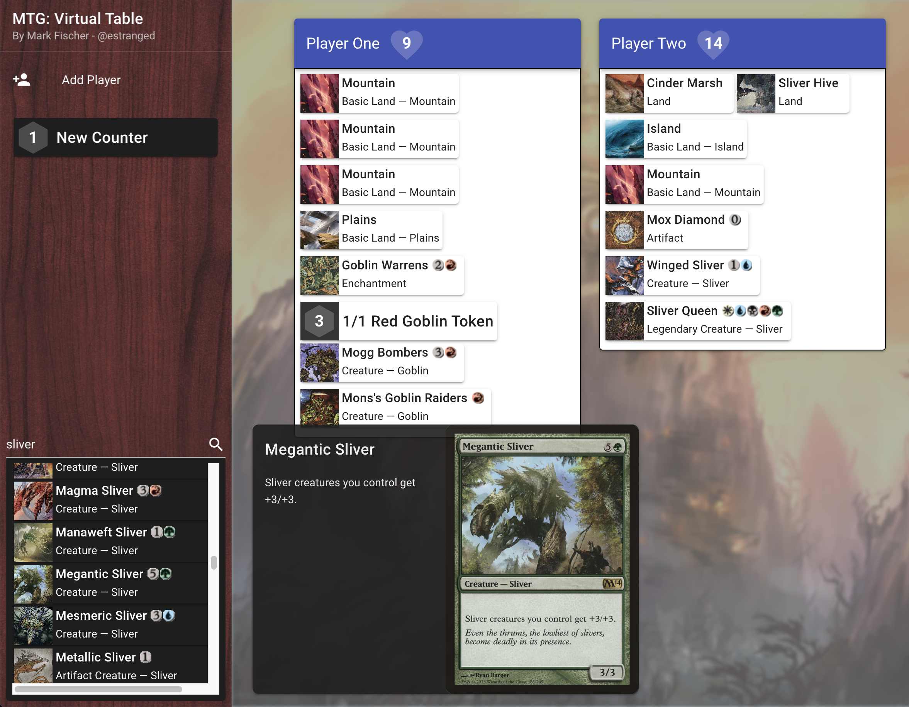

# MTG: Virtual Table

This tool grew out of a desire to play Magic the Gathering with friends during the pandemic. While we all had our
cards, we couldn't see everyone else's cards. With just two players, we could keep the other person's cards in our head
OK, but once you got to 3 or 4 players, it was a lost cause.

This tool allows one person to keep track of everyone's cards as they get played. They can then share their screen
so everyone can follow along.

See the [MTG: Virtual Table][mtgvirtual] site for an example. (Or just use this tool from there!)

[mtgvirtual]: https://mtgvirtualtable.fischco.org

## Features

* Multiple players
* Life tracking
* Card lookup courtesy of the [Scryfall API][scryfall]
* Customizable counter/token widgets
* Drag and Drop cards from search to a player

[scryfall]: https://scryfall.com/docs/api



## Architecture

This is a [Vue.js][vuejs] application that uses the [Vuetify][vuetify] UI library, [Vue Easy-DnD][easydnd], and the [blurhash][] library.

[vuejs]: https://vuejs.org/v2/guide/
[vuetify]: https://vuetifyjs.com/en/getting-started/installation/
[easydnd]: https://github.com/rlemaigre/Easy-DnD
[blurhash]: https://github.com/woltapp/blurhash/tree/master/TypeScript

## Development

This is a pretty standard Vue.js 2.0 application. Run `yarn serve` to start up the development host, and start editing.

### Project setup
```
yarn install
```

### Compiles and hot-reloads for development
```
yarn serve
```

### Compiles and minifies for production
```
yarn build
```

### Lints and fixes files
```
yarn lint
```

## Deployment

This project contains an AWS CloudFormation template to deploy an environment to host the static website files. It uses
an S3 bucket with CloudFront to handle SSL termination. You don't have to deploy this tool to AWS, any web host that can
serve static files will be fine. Just do a `yarn build` and then upload the contents of the `dist` folder to wherever you
want to host it (or just keep it local).

Deploying a site to [S3/CloudFront is not free][cloudfrontblog], but for a site that receives pretty low traffic, it is pretty cheap.

[cloudfrontblog]: https://aws.amazon.com/blogs/networking-and-content-delivery/amazon-s3-amazon-cloudfront-a-match-made-in-the-cloud/


### Deployment pre-requisites

* AWS Account
* [AWS CLI Tool][cli]
* [AWS IAM Access Keys][keys]
* [AWS CLI Profile][profile]
* [ACM SSL Certificate][acm]

[cli]: https://docs.aws.amazon.com/cli/latest/userguide/install-cliv2.html
[acm]: https://docs.aws.amazon.com/acm/latest/userguide/gs-acm-request-public.html
[keys]: https://docs.aws.amazon.com/IAM/latest/UserGuide/id_credentials_access-keys.html
[profile]: https://docs.aws.amazon.com/cli/latest/userguide/cli-configure-profiles.html

You will also need to create two local environment files which are not part of the repository. These hold your AWS account 
specific information.

#### environment-dev.sh
```
REQUIRE_SECRETS_FILE="true"
ACCOUNT_NUMBER_CHECK="XXXXXXXXXXX"
AWS_CLI_PROFILE="profilename"
HOSTNAME="mtgvirtualtable.example.com"
FRONTEND_STACK_NAME="mtgvirtualtable-site"
```

#### secrets-dev.sh
```
SSL_CERTIFICATE_ARN="arn:aws:acm:us-east-1:XXXXXXXXXXX:certificate/your-certificate-arn"
```

### Deploy

Once you have everything in place, you can deploy the CloudFormation template by running:
```
npm run deploy-aws
```

### Publish

Once the stack has been deployed, you can publish your built app up to the S3 bucket:
```
npm run publish
```

This will upload all current files from your `dist` folder to the S3 bucket, and delete any old files. It will
also perform a CloudFront invalidation, clearing the CloudFront cache so you can see your results immediately.
Note, there is a limit on how many CloudFront invalidations you can perform for free in a given timeframe. See
the [CloudFront costs][cloudfront] for details. Just don't setup some sort of bot that automatically publishes 24/7. :) 

[cloudfront]: https://docs.aws.amazon.com/AmazonCloudFront/latest/DeveloperGuide/Invalidation.html#PayingForInvalidation
